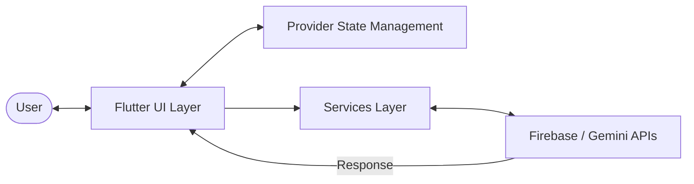

# Clariora ── Student Mental Well-Being App

<div align="center">

[](https://flutter.dev)
[](https://dart.dev)
[](https://firebase.google.com)
[](https://ai.google.dev/)
[](https://clariora.netlify.app/)

<h3>
  <a href="https://clariora.netlify.app/">Live Website & Web Portal</a>
  <span> | </span>
  <a href="#video-demonstration">Watch Demo Video</a>
</h3>

</div>

Clariora is a student-focused mobile application designed to provide **early, accessible, and stigma-free emotional support**. Developed as a personal learning and portfolio project, Clariora combines Flutter with Firebase and Google Gemini to help students reflect on their daily emotions, understand stress trends, and build emotional resilience.

---

## Project Portals
*   **Live Website**: [https://clariora.netlify.app/](https://clariora.netlify.app/)
*   **Demo Video (Local)**: [assets/demo/Clariora.mp4](assets/demo/Clariora.mp4)
*   **Demo Video (Online)**: [https://clariora.netlify.app/video_cLari.mp4](https://clariora.netlify.app/video_cLari.mp4)

---

## Table of Contents
1. [Problem Statement](#problem-statement)
2. [Our Solution](#our-solution)
3. [Key Features](#key-features)
4. [Video Demonstration](#video-demonstration)
5. [Technology Stack](#technology-stack)
6. [Architecture Overview](#architecture-overview)
7. [Mobile App Overview](#mobile-app-overview)
8. [Website Overview](#website-overview)
9. [Repository Structure](#repository-structure)
10. [Installation & Setup](#installation-setup)
11. [Screenshots Showcase](#screenshots-showcase)
12. [Learning Outcomes](#learning-outcomes)
13. [Future Improvements](#future-improvements)
14. [Author](#author)
15. [Copyright Notice](#copyright-notice)

---

## Problem Statement

Academic pressure, career uncertainty, and social adaptation heavily impact student mental health. However:
*   **High Stigma**: Students hesitate to seek professional therapy early due to social stigma.
*   **Fragmented Systems**: Wellness tools (journals, trackers, meditation apps) are scattered.
*   **Crisis Focus**: Traditional university support systems are often reactive, accessed only during crises.

There is a critical need for a **safe, unified, and approachable space** that students can interact with daily to check in on their emotional wellness.

---

## Our Solution

Clariora integrates **AI-powered sentiment tracking, empathetic companion chat, and peer community forums** into a single cohesive interface. Instead of waiting for crises, Clariora promotes daily self-reflection, mindfulness exercises, and peer connection, encouraging early emotional awareness in a natural, friendly manner.

---

## Key Features

| Feature | Description | Implementation Details |
| :--- | :--- | :--- |
| **Mood-Based Journaling** | Write daily logs and receive immediate AI emotional insights and sentiment tracking. | Gemini API classifies sentiment, stored in Cloud Firestore. |
| **AI Companion Chatbot** | Empathetic chatbot named Clariora listening to students' worries and answering dynamically. | Generates contextual, warm replies using `gemini-2.5-flash`. |
| **Mood Analysis Dashboard** | Graphic visualization of historical entries to trace personal mental wellness over time. | Interactive lines/charts rendered dynamically using `fl_chart`. |
| **Discover Quizzes** | Take Mood and Personality evaluations with custom recommendations. | Questions synced from Firestore; analysis parsed via Gemini. |
| **Meditation & Motivation**| Structured breathing and yoga animations accompanied by local music tracks. | Controls audio playback using the `audioplayers` package. |
| **Community Forums** | Anonymous discussion boards categorized by career, growth, and relationships. | Real-time broadcast rooms built using Firestore Collections. |
| **Soothing Theme System** | Toggle between light and dark backgrounds tailored for sensitive screen use. | State stored locally via `shared_preferences` and `Provider`. |

---

## Video Demonstration

Check out the complete walkthrough of the Clariora mobile application features, interactions, and design portals:

<div align="center">
  <video src="https://clariora.netlify.app/video_cLari.mp4" width="100%" style="max-width: 800px; border-radius: 8px; box-shadow: 0 4px 20px rgba(0,0,0,0.15);" controls>
    <source src="assets/demo/Clariora.mp4" type="video/mp4">
    <source src="https://clariora.netlify.app/video_cLari.mp4" type="video/mp4">
    Your browser does not support the video tag. You can view the demo video <a href="assets/demo/Clariora.mp4">here</a> or watch it on the <a href="https://clariora.netlify.app/">deployed portal</a>.
  </video>
</div>

---

## Technology Stack

*   **Frontend**: [Flutter](https://flutter.dev) (Dart)
*   **State Management**: [Provider](https://pub.dev/packages/provider) (ChangeNotifier)
*   **Backend Database & Session Auth**:
    *   [Firebase Authentication](https://firebase.google.com/docs/auth) (User Account creation, Login verification)
    *   [Cloud Firestore](https://firebase.google.com/docs/firestore) (Saves journals, user details, chats, and forum rooms)
*   **AI Models**: [Google Gemini API](https://ai.google.dev/) (via REST API endpoints)
*   **Audio Media Engine**: [Audioplayers](https://pub.dev/packages/audioplayers) (Meditation audio tracks)
*   **Data Visualization**: [fl_chart](https://pub.dev/packages/fl_chart) (Mood analysis curves)

---

## Architecture Overview

The codebase is built on a **Layered Architecture** style comprising:
1.  **UI View Layer** (Widgets & Screens consuming `Provider` state changes).
2.  **Controllers Layer** (Handles inputs and credentials validations).
3.  **State Provider** (Theme and User session state configurations).
4.  **Services Layer** (Abstracts Firebase connections, Gemini REST calls, and web requests).



For a comprehensive breakdown of sequences, parameters, and database schemas, check out [docs/architecture.md](docs/architecture.md).

---

## Mobile App Overview
The Clariora mobile application is the core of this project. It manages local states, plays relaxation media, runs interactive quizzes, and processes real-time forum messages. It is built as a cross-platform Flutter client, ensuring smooth animations and consistent styling.

---

## Website Overview
The companion landing website is located under the [website/](website/) directory and hosted on Netlify. It includes:
*   A marketing landing overview introducing Clariora's features.
*   An **About Us** page detailing the team motivation.
*   A direct download button for the compiled Android Application Package (**`Clariora.apk`**).
*   An embedded **Demo Video** displaying screen logs and interactive features.

Refer to [docs/website.md](docs/website.md) for more details.

---

## Repository Structure

The core directories are organized as follows:
```text
mentalhealthapp/
├── app/                        # Mobile Application Flutter source code
│   ├── android/, ios/, ...     # Native platform configuration folders
│   ├── assets/                 # App bundled assets (images, gifs, music, fonts)
│   ├── lib/                    # Core Flutter application source files
│   │   ├── controllers/        # Input validator controllers
│   │   ├── provider/           # Theme and session ChangeNotifier states
│   │   ├── screens/            # Main screen views (Dashboard, Journal, Chatbot)
│   │   ├── services/           # Service layers (Gemini API, Firestore queries)
│   │   └── widgets/            # Reusable UI component widgets
│   ├── test/                   # Flutter test suite files
│   └── pubspec.yaml            # Dart packages and assets declarations
├── website/                    # Deployed web folder containing landing page code (Netlify)
│   ├── index.html              # Main web portal landing page
│   ├── ABOUT.html              # Dedicated team about page
│   ├── style.css, script.js    # Visual layout styling and menu action controllers
├── docs/                       # Project portfolio documentation sub-modules
│   ├── architecture.md         # Detailed sequence flow charts & Use Case diagrams
│   ├── setup.md                # Prerequisites, installation, and key security instructions
│   ├── flow.md                 # Complete user journeys and screen navigation flowcharts
│   ├── screenshots.md          # Screenshot checklists and mapping table
│   ├── website.md              # Web page structure details and mobile integration flow
│   └── deployment.md           # Netlify publishing commands & Firestore access rules
├── assets/                     # Portfolio documentation media assets
│   ├── screenshots/            # Standardized PNG application screenshots
│   └── demo/                   # Demo mp4 walkthrough video
└── .gitignore                  # Upgraded configuration to secure developer keys
```

---

## Installation & Setup

1.  **Dependencies**: Clone the repository and fetch dependencies:
    ```bash
    git clone <your-repository-url>
    cd clariora/mentalhealthapp/app
    flutter pub get
    ```
2.  **Firebase Config**: Run `flutterfire configure` to generate [app/lib/firebase_options.dart](app/lib/firebase_options.dart) and configure Android/iOS projects.
3.  **Run the Project**: Ensure your test device or emulator is active, and run:
    ```bash
    cd app
    flutter run
    ```


Refer to [docs/setup.md](docs/setup.md) for complete database configuration, assets checking, and instructions on securing API keys.

---

## Screenshots Showcase

All existing screenshots are organized under [assets/screenshots/](assets/screenshots/):

<div align="center">
  <h3>Onboarding & Authentication</h3>
  <table>
    <tr>
      <td align="center" width="33%">
        <br/>
        <sub><b>Splash Screen</b><br/>Lotus branding & start animation</sub>
      </td>
      <td align="center" width="33%">
        <br/>
        <sub><b>Login Screen</b><br/>Secure Firebase authentication</sub>
      </td>
      <td align="center" width="33%">
        <br/>
        <sub><b>Sign Up Screen</b><br/>Custom credentials registration</sub>
      </td>
    </tr>
  </table>

  <h3>Self-Reflection & Personal Care</h3>
  <table>
    <tr>
      <td align="center" width="33%">
        <br/>
        <sub><b>Home Dashboard</b><br/>Weekly mood tracking & dynamic quote</sub>
      </td>
      <td align="center" width="33%">
        <br/>
        <sub><b>AI Journal Log</b><br/>Empathetic sentiment parsing</sub>
      </td>
      <td align="center" width="33%">
        <br/>
        <sub><b>Discover Evaluations</b><br/>Mood assessments & wellness checks</sub>
      </td>
    </tr>
  </table>

  <h3>Social & Support Layer</h3>
  <table>
    <tr>
      <td align="center" width="50%">
        <br/>
        <sub><b>AI Chatbot Thread</b><br/>Warm companion conversation UI</sub>
      </td>
      <td align="center" width="50%">
        <br/>
        <sub><b>Community Forums</b><br/>Real-time peer chat groups</sub>
      </td>
    </tr>
  </table>

  <h3>Adaptive Design & Theme Toggles</h3>
  <table>
    <tr>
      <td align="center" width="50%">
        <br/>
        <sub><b>Profile Settings (Light Theme)</b><br/>User stats & system preferences</sub>
      </td>
      <td align="center" width="50%">
        <br/>
        <sub><b>Profile Settings (Dark Theme)</b><br/>Low-light optimized visual interface</sub>
      </td>
    </tr>
  </table>
</div>

---

## Learning Outcomes

Developing Clariora has provided valuable hands-on software engineering and mobile development experience:
*   **Asynchronous API Integrations**: Structuring resilient HTTP REST calls to handle remote JSON analysis payloads.
*   **Real-time Synchronization**: Bridging Flutter streams with Cloud Firestore changes to maintain seamless chat and journaling updates.
*   **Declarative State Propagation**: Utilizing the Provider package to maintain modularity between controllers, data layers, and the UI tree.
*   **Sensitive UX Design**: Selecting calming color palettes (lavender, violet, royal purple) and styling responsive layouts for emotional wellness apps.

---

## Future Improvements

*   [ ] **Secret Key Hiding**: Refactoring the app's services to load API keys dynamically at build time using Dart environment constants.
*   [ ] **Push Notifications**: Gentle morning check-ins and self-reflection reminders.
*   [ ] **Local Offline Storage**: Offline journaling caching that syncs to Cloud Firestore when internet connection is restored.
*   [ ] **Analytics Filters**: Weekly, monthly, and yearly historical filters for the mood dashboard.

---

## Author

Developed by **The Arceus** (Copyright © 2025_The_Arceus). All rights reserved.

---

## Copyright Notice

Clariora is a personal learning and portfolio project. 

The source code is publicly visible for educational and demonstration purposes only. No permission is granted to copy, redistribute, modify, reuse, or submit this project as one's own work without explicit authorization from the author.
# Clariora

# Clariora

