# Clariora

<div align="center">
  <p><strong>Clarity that shines, an aura that inspires.</strong></p>
  <p>An AI-powered mental well-being application designed specifically for students to manage academic stress, track emotions, and build emotional resilience.</p>

  [](https://flutter.dev)
  [](https://dart.dev)
  [](https://firebase.google.com)
  [](https://ai.google.dev/)
  [](https://clariora.netlify.app/)

  <h3>
    <a href="https://clariora.netlify.app/"> Live Web Portal</a>
    <span> • </span>
    <a href="#video-demonstration"> Walkthrough Video</a>
    <span> • </span>
    <a href="https://clariora.netlify.app/"> Download Android APK</a>
  </h3>
</div>

---

## 📱 Application Interface

<div align="center">
  <table border="0">
    <tr>
      <td width="30%" align="center">
        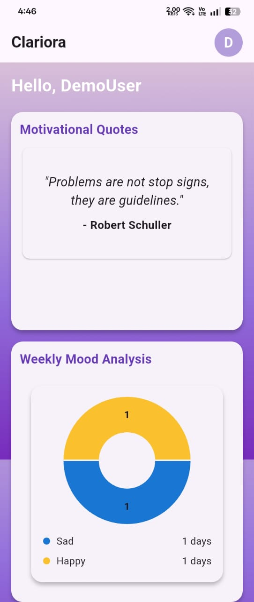<br/>
        <sub><b>Home Dashboard</b></sub>
      </td>
      <td width="30%" align="center">
        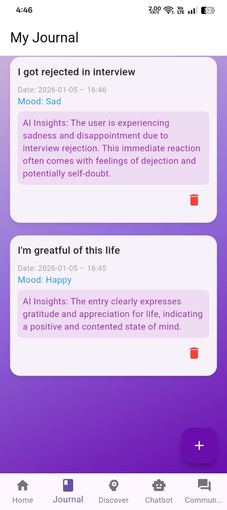<br/>
        <sub><b>AI Sentiment Journal</b></sub>
      </td>
      <td width="30%" align="center">
        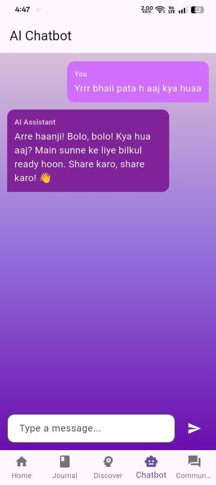<br/>
        <sub><b>Empathetic AI Companion</b></sub>
      </td>
    </tr>
  </table>
</div>

---

## Table of Contents
1. [Application Interface](#application-interface)
2. [Problem & Solution](#the-problem--our-solution)
3. [Core Features](#core-features)
4. [Video Demonstration](#video-demonstration)
5. [Architecture & Tech Stack](#architecture--technology-stack)
6. [Repository Layout](#repository-layout)
7. [Quick Start](#quick-start)
8. [Full Screenshots Gallery](#full-screenshots-gallery)
9. [Learning Outcomes](#learning-outcomes)
10. [Future Roadmap](#future-roadmap)
11. [Author & Copyright](#author)

---

## The Problem & Our Solution

Academic pressure, social adaptation, and career uncertainty heavily impact student mental health. Due to societal stigma and reactive support systems, students often hesitate to seek help early.

**Clariora** bridges this gap by integrating **AI-powered sentiment journaling, empathetic companion chat, and peer discussion forums** into a unified, calming interface. By promoting daily check-ins, guided mindfulness exercises, and peer connection, Clariora makes emotional support early, approachable, and judgment-free.

---

## Core Features

*   ** Mood-Based Journaling**: Write daily logs and receive immediate AI emotional insights and sentiment tracking (stored in Cloud Firestore, classified via Gemini).
*   ** Empathetic Companion Chatbot**: Chat 24/7 with Clariora, an AI companion designed to provide supportive, warm conversations.
*   ** Stress & Mood Dashboard**: Track personal mood curves and weekly analytics rendered dynamically via line and donut charts (`fl_chart`).
*   ** Self-Discovery Quizzes**: Evaluate mood and personality traits through streaming quiz collections with customized AI advice.
*   ** Mindfulness & Audio**: Relax with structured breathing exercises and local ambient soundscapes (`audioplayers`).
*   ** Real-Time Forums**: Join anonymous categories (career, relationships, growth) to discuss with peers.

---

## Video Demonstration

Check out the complete walkthrough of the Clariora mobile application features, interactions, and design portals:

<div align="center">
  <video src="https://clariora.netlify.app/video_cLari.mp4" width="100%" style="max-width: 800px; border-radius: 8px; box-shadow: 0 4px 20px rgba(0,0,0,0.15);" controls>
    <source src="assets/demo/Clariora.mp4" type="video/mp4">
    <source src="https://clariora.netlify.app/video_cLari.mp4" type="video/mp4">
    Your browser does not support the video tag. You can view the demo video <a href="assets/demo/Clariora.mp4">here</a> or watch it on the <a href="https://clariora.netlify.app/">deployed portal</a>.
  </video>
</div>

---

## Architecture & Technology Stack

The codebase follows a decoupled **Layered Architecture** split into UI, Controllers, State Providers, and Services to ensure platform modularity and scalability.

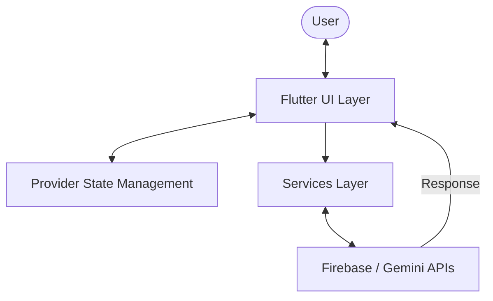

*   **Frontend**: Flutter (Dart) with `Provider` state propagation.
*   **Backend Database & Session Auth**: Firebase Authentication & Cloud Firestore.
*   **AI Integration**: Google Gemini API (`gemini-2.5-flash`).
*   **Data Visualization & Audio**: `fl_chart` & `audioplayers` packages.

*For complete sequencing schemas, Firestore security configurations, and database layouts, see the [Architecture Guide](docs/architecture.md).*

---

## Repository Layout

```text
mentalhealthapp/
├── app/          # Flutter Mobile Application Source Code
├── website/      # Deployed Netlify Landing Portal Source
├── docs/         # Detailed Architecture, Setup, and Deployment Guides
└── assets/       # Portfolio Documentation Screenshots & Demo Video
```

---

## Quick Start

### 1. Clone & Fetch Dependencies
```bash
git clone https://github.com/SyntaxNoob19/Clariora.git
cd Clariora/mentalhealthapp/app
flutter pub get
```

### 2. Configure Firebase
Run the FlutterFire CLI command inside the `app/` directory to generate your `firebase_options.dart`:
```bash
flutterfire configure
```

### 3. Run the App
With a physical device or emulator active:
```bash
flutter run
```

*For complete configurations, database seeding scripts, and guidance on migrating hardcoded keys to environment configs, refer to the [Setup Guide](docs/setup.md).*

---

## Full Screenshots Gallery

<details>
<summary><b>Click to expand screenshots gallery</b></summary>
<br>

<div align="center">
  <h3>Onboarding & Authentication</h3>
  <table>
    <tr>
      <td align="center" width="33%">
        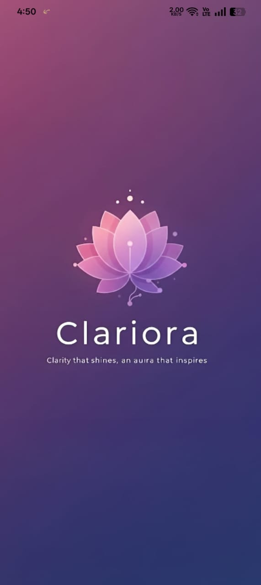<br/>
        <sub><b>Splash Screen</b><br/>Lotus branding</sub>
      </td>
      <td align="center" width="33%">
        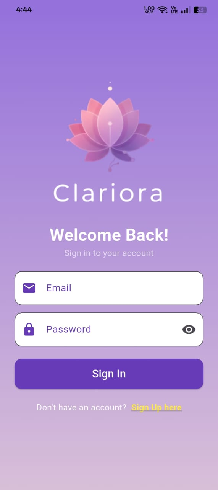<br/>
        <sub><b>Login Screen</b><br/>Firebase Auth</sub>
      </td>
      <td align="center" width="33%">
        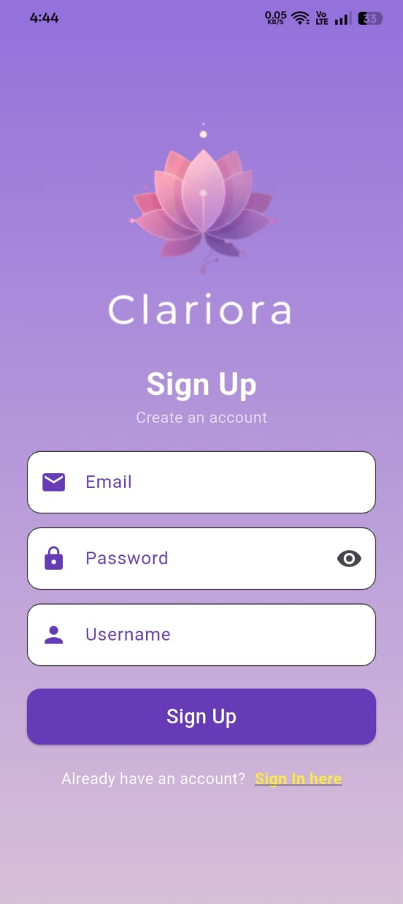<br/>
        <sub><b>Sign Up Screen</b><br/>User Registration</sub>
      </td>
    </tr>
  </table>

  <h3>Self-Reflection & Personal Care</h3>
  <table>
    <tr>
      <td align="center" width="33%">
        <br/>
        <sub><b>Home Dashboard</b><br/>Weekly mood tracking</sub>
      </td>
      <td align="center" width="33%">
        <br/>
        <sub><b>AI Journal Log</b><br/>Gemini sentiment parsing</sub>
      </td>
      <td align="center" width="33%">
        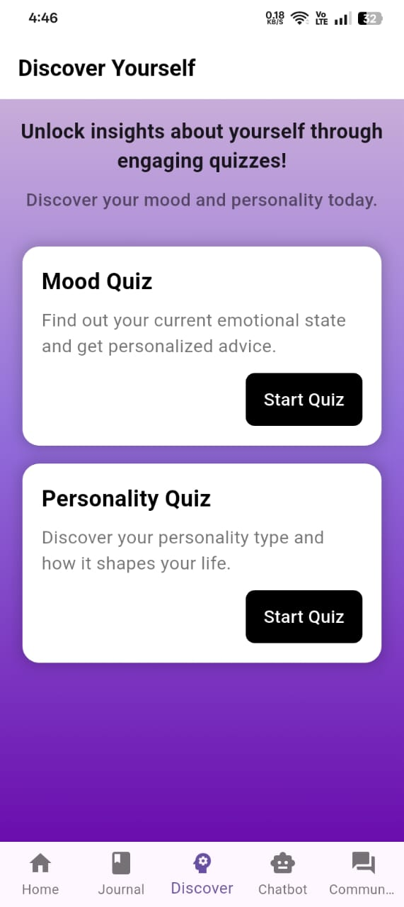<br/>
        <sub><b>Discover Evaluations</b><br/>Wellness quizzes</sub>
      </td>
    </tr>
  </table>

  <h3>Social & Support Layer</h3>
  <table>
    <tr>
      <td align="center" width="50%">
        <br/>
        <sub><b>AI Chatbot Thread</b><br/>Gemini companion chat</sub>
      </td>
      <td align="center" width="50%">
        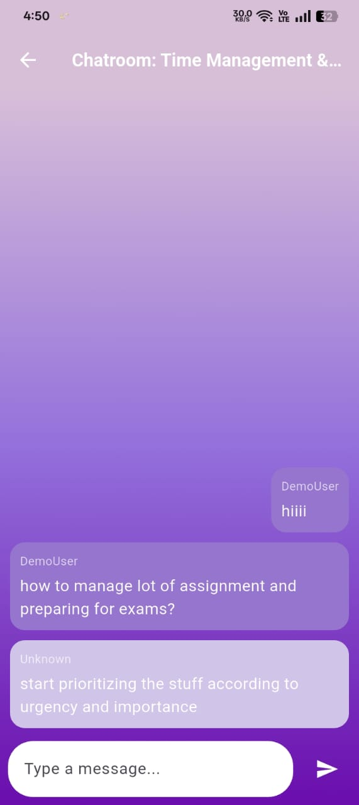<br/>
        <sub><b>Community Forums</b><br/>Real-time discussion groups</sub>
      </td>
    </tr>
  </table>

  <h3>Adaptive Design & Theme Toggles</h3>
  <table>
    <tr>
      <td align="center" width="50%">
        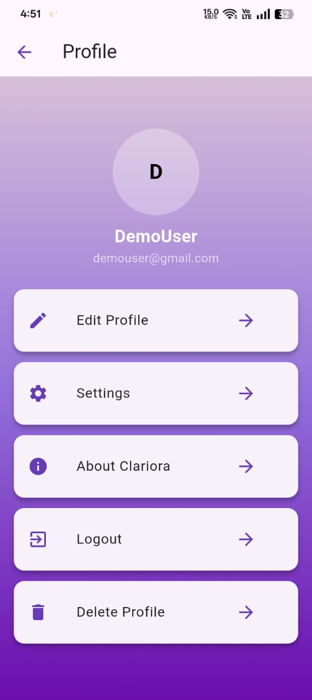<br/>
        <sub><b>Profile Settings (Light Theme)</b><br/>User preferences</sub>
      </td>
      <td align="center" width="50%">
        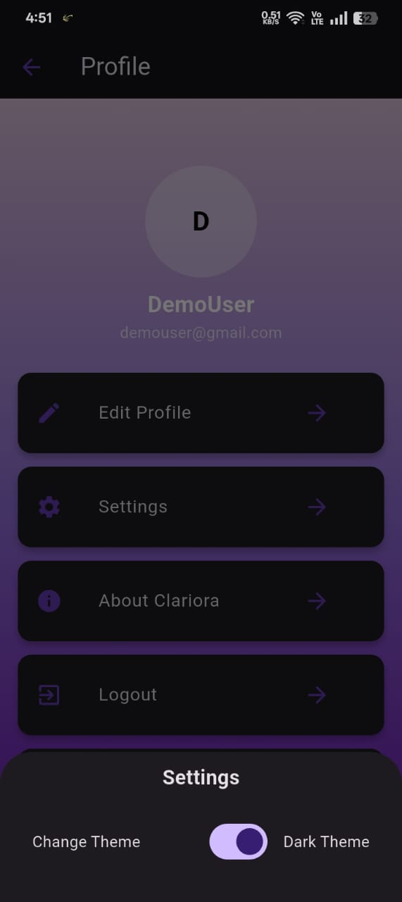<br/>
        <sub><b>Profile Settings (Dark Theme)</b><br/>Dark mode theme support</sub>
      </td>
    </tr>
  </table>
</div>
</details>

---

## Learning Outcomes

Developing Clariora has provided valuable software engineering and cross-platform mobile experience:
*   **Resilient API Implementations**: Designed structured HTTP requests to handle remote JSON sentiment analysis payloads.
*   **Real-time Synchronization**: Linked Flutter streams with Cloud Firestore changes to maintain seamless chat and journaling updates.
*   **Declarative State Propagation**: Leveraged Provider ChangeNotifier to clean separation of UI widgets, controllers, and service layers.
*   **Empathetic UX Styling**: Tailored calm color palettes (lavender, violet, royal purple) and visually responsive controls suited for emotional wellness interfaces.

---

## Future Roadmap

-  **Dynamic Key Loading**: Load API keys at build-time using Dart environment defines (outlined in [docs/setup.md](docs/setup.md)).
-  **Offline Journal Caching**: Local journaling cache that syncs to Cloud Firestore once internet connectivity is restored.
     **Push Notifications**: Gentle daily reflection prompts and self-care check-in reminders.
- **Extended Analytics**: Monthly and yearly historical filters for the mood tracker dashboard.

---

## Copyright Notice

Clariora is a personal learning and portfolio project. 

The source code is publicly visible for educational and demonstration purposes only. No permission is granted to copy, redistribute, modify, reuse, or submit this project as one's own work without explicit authorization from the author.
