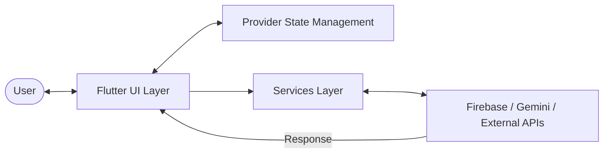
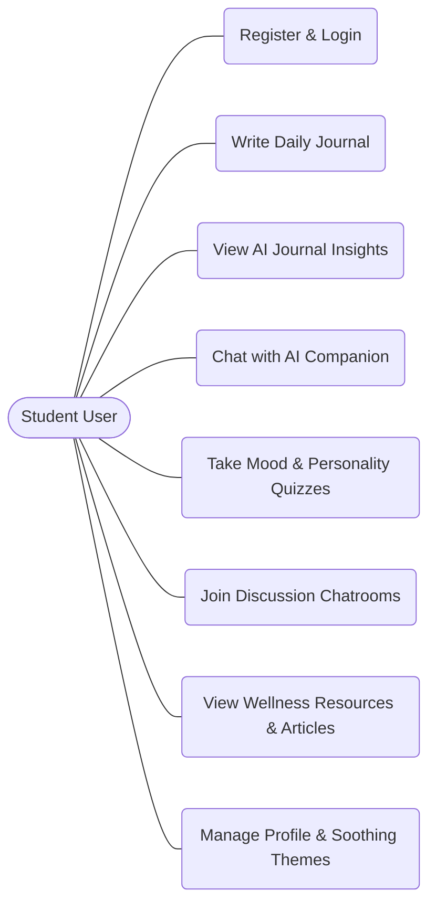
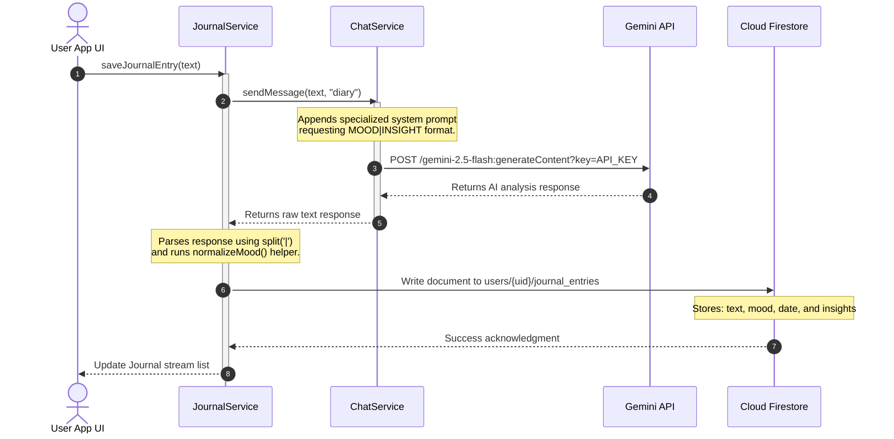

# Clariora Architecture Documentation

This document describes the design and technical architecture of the Clariora student mental well-being application. The project is designed with a lightweight, multi-layered architecture suitable for a mobile application utilizing Firebase and AI services.

---

## Architectural Overview

Clariora is structured using a multi-layer decoupling pattern that isolates the User Interface from state variables, logic layers, and third-party API endpoints.

### Systems Architecture Diagram

1. **UI Layer (`lib/screens/`, `lib/widgets/`)**: Declarative Flutter widgets that render the application UI. They consume state from `Provider` components or listen directly to Firestore streams.
2. **Controllers Layer (`lib/controllers/`)**: Dedicated controllers for managing user inputs and validation during specific workflows like Sign In and Sign Up.
3. **State Management (`lib/provider/`)**: Uses Flutter's `Provider` package (ChangeNotifier) to share global states (user data, active theme) down the widget tree.
4. **Services Layer (`lib/services/`)**: Static helper classes that isolate interactions with Firebase, HTTP web APIs, and device features (audio players, local settings).
5. **Data Layer (Firebase / External APIs)**: Secure cloud data hosting and AI processing.

---

## Use Case Diagram

The following diagram maps out the primary use cases of the application, representing how a student user interacts with Clariora's features:

---

## State Management Approach

Clariora uses the **Provider** package for dependency injection and state propagation. The application root registers these providers globally inside `lib/main.dart` using a `MultiProvider`:

*   **`UserProvider` (`lib/provider/user_provider.dart`)**:
    *   Tracks the current user's profile information (Username, Email).
    *   Exposes a method `getUserData()` that fetches user records from Firestore and updates the UI reactively when the user logs in.
*   **`ThemeProvider` (`lib/provider/theme_provider.dart`)**:
    *   Stores the current visual theme state (Light Mode vs. Dark Mode).
    *   Reads and writes preferences to persistent local storage using `shared_preferences` so themes persist between app restarts.

---

## Services & Integrations

The service layer forms the core logic bridge. There are six main service modules:

| Service | File Path | Responsibility | Integrations |
| :--- | :--- | :--- | :--- |
| **`ChatService`** | [chat_service.dart](../app/lib/services/chat_service.dart) | Connects directly to Google Gemini REST endpoints. Houses system prompts for the Chatbot, Journal Analyzer, and Quiz recommendations. | Google Gemini API (gemini-2.5-flash) via HTTP |
| **`JournalService`** | [journal_service.dart](../app/lib/services/journal_service.dart) | Saves and deletes user journal entries, requesting sentiment insights from the Gemini API and writing responses to Firestore. | Cloud Firestore & `ChatService` |
| **`FirestoreService`** | [firestore_service.dart](../app/lib/services/firestore_service.dart) | Pre-seeds chatroom categories and forums into Cloud Firestore collections if they don't already exist. | Cloud Firestore |
| **`QuizService`** | [quiz_service.dart](../app/lib/services/quiz_service.dart) | Uploads static quiz questions (Mood Quiz & Personality Quiz) to Firestore on initialization. | Cloud Firestore |
| **`QuoteService`** | [quote_service.dart](../app/lib/services/quote_service.dart) | Fetches a random motivational quote to display on the dashboard screen, falling back to a static quote if offline. | HTTP (api.quotable.io) |
| **`ArticleService`**| [article_service.dart](../app/lib/services/article_service.dart) | Fetches educational articles related to mental wellness from Firestore. | Cloud Firestore |

---

## Core Data Flows

### AI-Powered Journaling Workflow
When a user writes in their journal, the application triggers a sequential flow to predict emotion and fetch comforting insights.

### Personality & Mood Quiz Workflow
1.  **Quiz Seeding**: On setup, the administrator triggers `QuizService.addQuizQuestions()` which populates `/quizzes/{quizType}/questions` in Firestore.
2.  **Taking the Quiz**: The `QuizQuestionPage` pulls the questions from Firestore, presenting them as a multi-step form to the user.
3.  **Insights Generation**: When the user answers the final question, the app sends a request to `ChatService` with the instructions: *"Analyze the user's quiz responses to provide personalized insights... Offer supportive advice..."* and the category parameter `"quiz"`.
4.  **Results Render**: The generated response is passed down to `QuizResultsPage` alongside the user's responses, rendering them dynamically on the screen.
