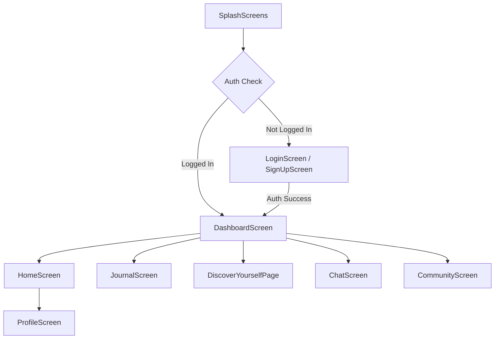

# Clariora User Flow & Navigation Documentation

This document maps the user flows, screen routing, and interactive workflows of the Clariora mental health application.

---

## 1. Application Onboarding & Screen Flow

When a user launches the application, the app decides whether to show the authentication screen or the main application dashboard container.

### User Flow Diagram

---

## 2. Core Feature Workflows

### AI Journal Flow
1.  **Open Journal**: The user selects the **Journal** tab.
2.  **Input Thoughts**: The user writes down their day's events or emotional expressions.
3.  **Submit**: Tapping the **Save** button triggers a call to `JournalService.saveJournalEntry`.
4.  **AI Sentiment Processing**:
    *   The entry is processed by `ChatService.sendMessage` with target feature `"diary"`.
    *   Gemini processes the text and responds with `MOOD|INSIGHT`.
    *   The service normalizes the mood (Happy, Sad, Anxious, Stressed, Angry, Motivated, Neutral).
5.  **Persistence**: The entry, along with its predicted mood, date, and insights, is stored in Firebase Firestore under `users/{uid}/journal_entries/`.
6.  **Refresh**: The screen automatically updates via a Firestore Stream.

---

### Discover Quizzes Flow
1.  **Browse Quizzes**: Under the **Discover** tab, users choose between the **Mood Quiz** or the **Personality Quiz**.
2.  **Take Quiz**: The app routes to `QuizQuestionPage`. It streams questions dynamically from the Firestore `quizzes/{quizType}/questions/` collection.
3.  **Answer Selection**: The user selects an option for each question and clicks **Next**.
4.  **Process Advice**: Upon answering the final question, the app requests AI-generated tips and emotional reviews using the Gemini API (system prompt for `"quiz"`).
5.  **Render Results**: Tapping **See Results** routes to `QuizResultsPage` to display the answers and the personalized advice.

---

### AI Chatbot Interface Flow
1.  **Enter Chat**: The user selects the **Chatbot** tab.
2.  **Interact**: The user writes a message to the AI Companion.
3.  **Process Empathetic Response**: The message is sent to `ChatService` with feature `"chatbot"`. Gemini acts under a system prompt tailored as a warm, Indian mental health guide named Clariora.
4.  **State Management**: Messages are added in-memory to the page state. No records are written to Firestore for these chatbot screens, keeping the chat session transient and private.

---

### Community Forums Flow
1.  **Browse Communities**: Under the **Community** tab, the screen streams discussion categories from Firestore (e.g., *Mental Health & Well-being*, *Career & Productivity*).
2.  **Select Chatroom**: Tapping a category displays its chatrooms (e.g., *Stress & Anxiety*, *Mindfulness & Self-Care*).
3.  **Real-Time Forum Discussion**: Tapping a chatroom enters the active `ChatroomScreen`. Users can view messages sent by peers and broadcast their own.
4.  **Database Sync**: Messages are fetched via a real-time Firestore collection stream `categories/{categoryId}/chatrooms/{chatroomId}/messages/` sorted by timestamp.
